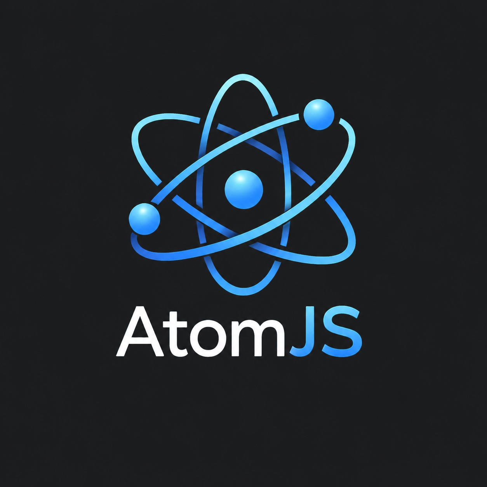

<p align="center">
  
</p>

# AtomJS

> **Windows:** AtomJS uses a prebuilt WebView2 binding. CMake and Visual Studio Build Tools are not required for normal installation or builds, and the project may live in any writable directory. AtomJS itself stays in one application process; Microsoft WebView2 can still create its own sandboxed renderer/GPU processes.

**Build fast, lightweight cross-platform desktop apps with JavaScript, HTML, and CSS.**

AtomJS keeps the Electron development model while rendering with the operating system WebView instead of shipping a private Chromium runtime in every application.

```js
const { app, BrowserWindow, ipcMain } = require('electron');
const path = require('node:path');

app.whenReady().then(() => {
  const win = new BrowserWindow({
    width: 1000,
    height: 700,
    webPreferences: {
      preload: path.join(__dirname, 'preload.js')
    }
  });

  win.loadFile('index.html');
});

ipcMain.handle('files:read', async (_event, filePath) => {
  return require('node:fs/promises').readFile(filePath, 'utf8');
});
```

AtomJS publishes the facade as `@atom-js-org/electron`. Applications install it with the local alias `electron`, so dependencies that call `require('electron')` or `import('electron')` resolve to AtomJS rather than the Electron runtime.

That means packages such as MSMC do not need an AtomJS-specific release merely to locate `BrowserWindow`:

```js
const { BrowserWindow } = require('electron');
```

The facade supports CommonJS, ESM, `electron/main`, `electron/renderer`, preload `contextBridge`, and Electron runtime detection through `process.versions.electron`.

## Native window customization

AtomJS maps common Electron window options to AppKit and Win32/WebView hosts:

```js
const main = new BrowserWindow({
  width: 1100,
  height: 760,
  minWidth: 720,
  minHeight: 520,
  frame: true,
  resizable: true,
  alwaysOnTop: false,
  transparent: false,
  opacity: 1,
  titleBarStyle: 'hiddenInset',
  trafficLightPosition: { x: 18, y: 16 }
});

const login = new BrowserWindow({
  parent: main,
  modal: true,
  width: 520,
  height: 720
});
```

Owned and modal windows stay associated with their parent. Windows login/OAuth windows are explicitly activated instead of remaining behind the main application. macOS uses native sheets for modal windows.

## Distribution customization

`atom.config.json` controls application icons, artifact names, Windows executable metadata and NSIS pages, macOS bundle/signing/DMG properties, and Linux package names and dependencies. Linux builds can emit a standalone binary, portable tarball, AppDir, AppImage, `.deb`, and `.rpm` when the corresponding packaging tool is available. See [`docs/BUILDING.md`](docs/BUILDING.md).

## CLI

```bash
atom run dev
atom run build

atom build windows
atom build macos
atom build linux
atom build all
```

Build artifacts are written to:

```text
build/
├── windows/
├── macos/
└── linux/
```

A local build is created when the requested target matches the host OS. Cross-OS and `all` builds are delegated to the included GitHub Actions workflow and downloaded into the same `build/<os>` layout.

## Architecture

AtomJS mirrors Electron's familiar split:

- **Main process:** regular Node.js; owns application lifecycle, filesystem access, dependencies, and privileged APIs.
- **BrowserWindow:** maps Electron-style options and parent/modal relationships to native platform windows.
- **Renderer:** ordinary HTML, CSS, and browser JavaScript.
- **Preload bridge:** supports `require('electron')`, `contextBridge`, and `ipcRenderer`.
- **IPC:** authenticated localhost WebSocket transport between the renderer and Node.js main process.
- **Compatibility facade:** exposes Electron-style module names to application code and transitive npm dependencies.

AtomJS uses the operating-system WebView: WKWebView on macOS, WebView2 on Windows, and WebKitGTK on Linux. WebView2 uses the Microsoft Edge rendering engine, so Windows still uses a Chromium-derived system engine, but AtomJS does not ship its own Chromium copy. Windows uses the prebuilt `@webviewjs/webview` binding in the AtomJS main process, so normal installation does not require CMake or Visual Studio Build Tools. Linux currently uses the small `webview-nodejs` adapter. macOS uses one native Cocoa/WKWebView host compiled with the system SDK; it does not use `osascript` and does not create a separate application identity for every window.

## Electron compatibility

AtomJS provides an Electron-compatible package that is installed locally under the alias `electron`, backed by AtomJS rather than Electron. It currently includes the working core (`app`, `BrowserWindow`, `webContents`, IPC, dialogs, shell, clipboard, menus-as-data, session compatibility, navigation events, and preload APIs) plus compatibility surfaces for many commonly imported Electron modules.

Chromium-specific behavior and native platform features cannot become identical merely by changing the module name. APIs that are not implemented by the system-WebView runtime remain explicit compatibility stubs rather than silently pretending to work. The project goal is to expand functional Electron compatibility release by release while keeping the runtime lightweight.

## Important technical truth

AtomJS contains no Rust and does not bundle Chromium. Plain Node.js cannot directly create an AppKit/WKWebView window, so macOS uses a small Objective-C host compiled with Apple's Command Line Tools. The application logic and public API remain Node.js, while one native host owns all macOS windows. Windows uses a prebuilt native adapter for WebView2, while Linux still requires the WebKitGTK adapter and its development packages.

This is an **alpha foundation**, not yet a production-complete reimplementation of every Electron API. The compatibility layer supports Electron-oriented dependencies such as MSMC, repeated OAuth navigation events, owned login windows and foreground activation on Windows.

## Install this repository

```bash
npm install
npm test
npm run verify:electron
```

## Create an application after the alpha packages are published

```bash
npm install electron@npm:@atom-js-org/electron@alpha
npm install --save-dev @atom-js-org/cli@alpha
```

On macOS, AtomJS uses a shared native WKWebView host and does not require `webview-nodejs` or `osascript`. The first development run may compile the host with the Xcode Command Line Tools. Windows uses a prebuilt WebView2 binding and does not require CMake or Visual Studio Build Tools. Linux uses `webview-nodejs` with the WebKitGTK development packages. Run `npx atom doctor` for platform checks.

## License

Framework forks and redistributions are permitted, but must retain the AtomJS notice and GitHub link. Applications built with AtomJS do **not** have to display AtomJS credit. See [`LICENSE`](LICENSE) and [`NOTICE`](NOTICE).
